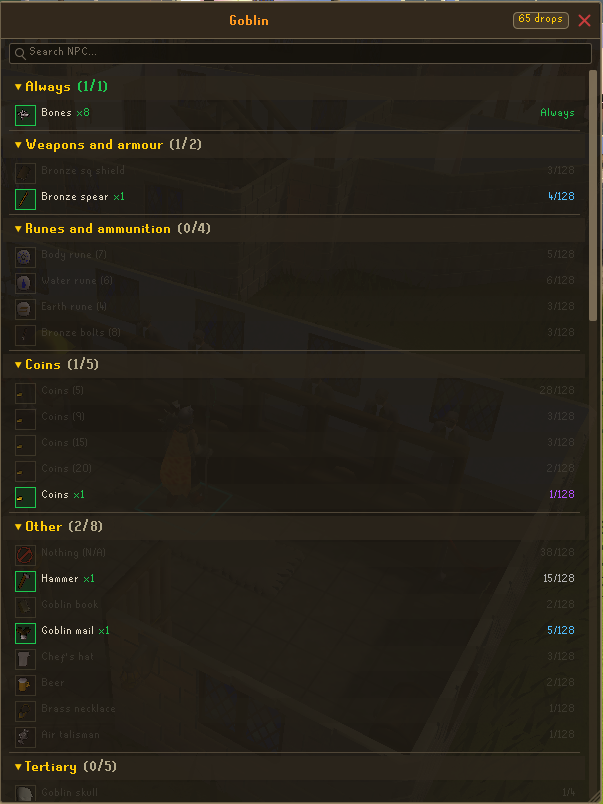

# Collection Log Expanded
## A better way to visualize your collection logs

## Features  
* Search Bar  
* Adjustable location, with location permanance  
* Collection Log, with tracking per enemy type  
* Counter for amount of times drop has been recieved  
* Collapsable Sections (Click # Drops to collapse all)  
* Side panel  
* Easter Eggs?  

## Update V1.1 - 05/18/26
* Added ability to resize window
* Only enemies with a combat level show the "Collection Log" menu entry
* Ability to show Completion Count (change in settings)

## Planned Updates
* Better detection for enemies with multiple variants, such as Hobgoblins
* Ability to see your dry percentage (toggle)
* Fix clue scrolls
* Add color themes
* Opacity slider for background and foreground elements
* Show tracked killcount

If you have any ideas for a plugin, please let me know by either messaging me ingame @ "The Riptide"
or commenting on my reddit posts.

## FAQ
* Q: Why are some kills on an NPC not showing in the log?  
 A: You must first open a collection log for an NPC before you can populate it.

* Q: How do I get rid of / reset a specific creature in my log?  
 A: To delete cache for NPC drop logs, go to \Users\\{Your Name}\\.runelite\collection-log-expanded  
  &nbsp;&nbsp;&nbsp;&nbsp;&nbsp;Delete any of the .Json files for the mobs you want to reset.

## Media - 
### Collection Log  
  

### Collection Log filled in with drops  

### Collection completion Count

## Credits -
***August Burns - Lead Engineer***  
***Usain Holt - Lead Designer***
